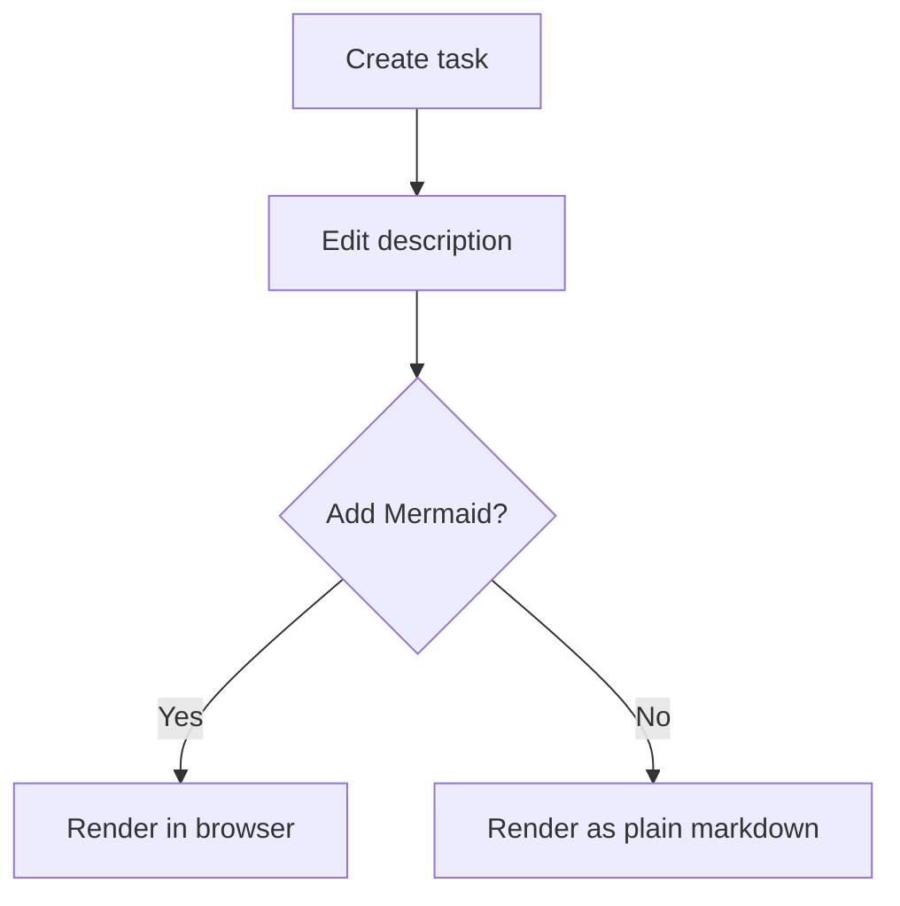
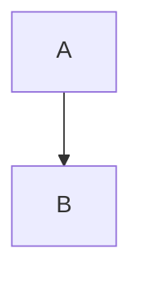

## Description

<!-- SECTION:DESCRIPTION:BEGIN -->
This task adds support for rendering Mermaid diagrams embedded in markdown fields (Description, Implementation Plan, Notes) and in documentation/decision pages when using the `backlog browser` web UI.

Example of a simple task workflow diagram:

<!-- SECTION:DESCRIPTION:END -->

## Acceptance Criteria
<!-- AC:BEGIN -->
- Mermaid diagrams in task, document or decision markdown preview render as diagrams in the web UI.
- No regressions for markdown that doesn't contain mermaid blocks.

- [x] #1 Mermaid diagrams in task, document or decision markdown preview render as diagrams in the web UI.
- [x] #2 No regressions for markdown that doesn't contain mermaid blocks.
<!-- AC:END -->

## Implementation Plan

<!-- SECTION:PLAN:BEGIN -->
* Detection: support fenced code blocks with the info string "mermaid". 
* Frontend: UI component that lazy-loads the Mermaid library and converts blocks into inline SVG.
* Security: sanitize rendered SVG and enforce size/time limits to prevent abuse.
* Performance: lazy-load library, server-side cache for reused diagrams.
* Fallback: show original code block with a message when rendering is unavailable.
* Dependencies/build: added mermaid and configured bundler for dynamic import.
* Tests: unit tests for the parser, the component; manual test with a simple example

<!-- SECTION:PLAN:END -->

## Implementation Notes

<!-- SECTION:NOTES:BEGIN -->
- See code changes in `src/web/utils/mermaid.ts` and `src/web/components/MermaidMarkdown.tsx`.
- Replaced previews to use the new component in TaskDetailsModal, DocumentationDetail and DecisionDetail.

<!-- SECTION:NOTES:END -->
